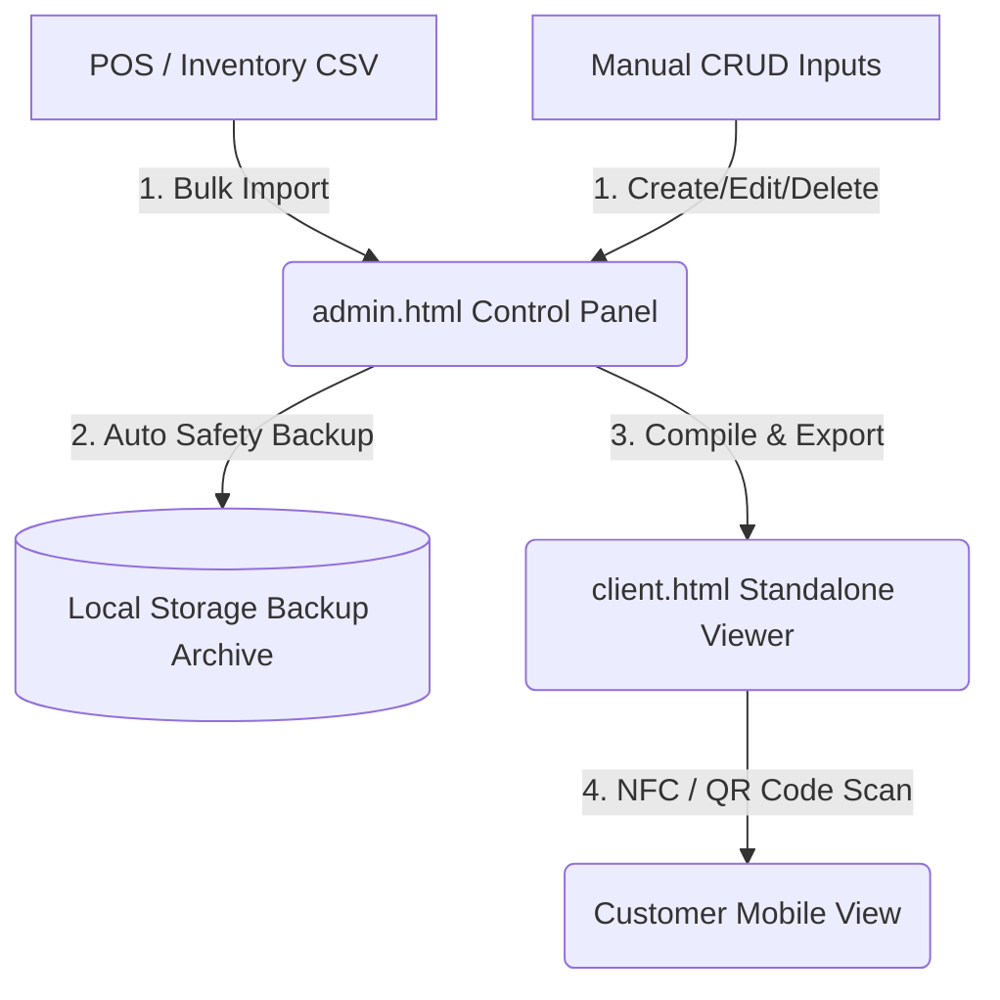

# 👑 King Tobacco Dynamic Menu System

A sleek, lightweight, offline-first digital menu management system designed specifically for quick-deployment scenarios (like NFC tags or QR code targets).

The system consists of two primary static HTML files that handle operations entirely inside the browser without requiring any server-side databases or subscription platforms.

---

## 📂 System Architecture Overview



1. **`admin.html` (The Control Panel)**: A private workstation application. It handles inventory modification, branding, visual styling, bulk CSV parsing, double-check deletion safeguards, and dated data backup logs. It stores all data inside the browser's persistent `localStorage`.
2. **`client.html` (The Public Menu)**: The clean, static customer menu page. It contains zero administrative tools or input forms. It receives its database embedded straight into its core script code during export.

---

## 🚀 Quick Start Guide

### Step 1: Initialize Your Workspace
Open [`admin.html`](file:///C:/Users/bradl/gemini-cli/personal/Other%20Projects/KingTobacco/admin.html) directly in any modern desktop web browser (Chrome, Safari, Edge, or Firefox).

### Step 2: Set Up Brands & Custom Colors
* **Create Brand**: On the sidebar, input the name of your brand (e.g., `Geek Bar` or `Fogger`).
* **Color Customization**: Pick a specific color accent matching the brand's branding using the color wheel. This color is dynamically styled on the customer interface.
* **Logo Management**:
  * Enter an online image URL path, or
  * **Upload Image File**: Select a local logo image file. The system will convert it automatically to an offline-compatible Base64 format saved directly inside your local storage space.

### Step 3: Populate Flavors
* **Inline Adding**: Navigate to the brand's card on the dashboard, write a flavor name in the inline search box, and click **Add** or press **Enter**.
* **Bulk CSV Import**:
  1. Export your POS system's inventory to a spreadsheet.
  2. Structure the data into a simple **2-column CSV file** matching:
     ```csv
     Brand,Flavor
     Geek Bar,Miami Mint
     Geek Bar,Watermelon Ice
     Fogger,White Gummy
     ```
  3. Upload the file using the **Import CSV Inventory** panel in the sidebar. 
  4. The system automatically populates all brands, sets up gold accents for new entries, sorts list items, and flags duplicates.

### Step 4: Double-Checked Safety & Deletion Backups
To prevent costly human error, the system employs strict safety rules:
* **Deletion Double Check**: When deleting a brand or flavor, you are prompted to type the exact name of the item you want to destroy before the delete button activates.
* **Auto-Dated Backups**: Any deletion or CSV import triggers an automatic backup snapshot.
* **Restore Safety Nets**: Scroll down to the **Dated Backups** panel to restore past snapshots with one click, or save manual snapshots before making large sweeps.

### Step 5: Exporting the Public Viewer
1. Click **Export Client Menu** in the header.
2. A customized, single-file compilation of [`client.html`](file:///C:/Users/bradl/gemini-cli/personal/Other%20Projects/KingTobacco/client.html) will compile and download instantly to your device.
3. Host `client.html` online (using free options like Netlify, GitHub Pages, Vercel, or local servers) and direct your QR codes or NFC tag links directly to the hosted URL.

---

## 📊 Technical Data Schema

Data is saved locally under the key `king_tobacco_inventory` as a nested JSON object structure:

```json
{
  "Brand Name": {
    "color": "#HEXCODE",
    "logo": "data:image/... [Base64 string] OR http://image.url",
    "flavors": [
      "Flavor A",
      "Flavor B"
    ]
  }
}
```

---

## 🎨 Visual Quality & Design Tokens

Both pages feature premium, modern design elements tailored for dark-mode screens:
* **Typography**: `'Space Grotesk'` (Geometric headers) paired with `'Outfit'` (Premium readable tags).
* **Color Palette**: Rich pitch-black body (#0b0b0d), card borders (#2d2d38), and high-contrast gold accents (#d4af37).
* **Aesthetic Highlights**: Custom thin scrollbars, soft glassmorphism overlays, color border left strips, and micro-interaction button elevations.
